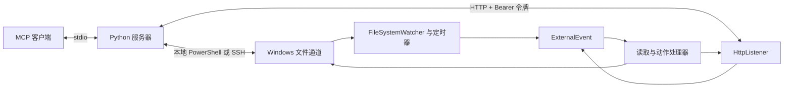

# 架构

## 组件

[Python 服务器](../server/revit_model_mcp/server.py)注册读取工具和可选的动作工具，然后构造任务。
[RevitReadChannel](../server/revit_model_mcp/revit_channel.py)使用 asyncio 锁将调用串行化。
[HTTP 主机](../server/revit_model_mcp/http_host.py)提交任务，并按 ID 轮询结果。
[PowerShell 主机](../server/revit_model_mcp/ssh_host.py)在本地或通过 SSH 发布任务并读取响应。
[插件应用](../src/RevitModelMcp.Addin/Application.cs)创建 Revit ExternalEvent 和心跳。
Core 项目包含解析器、数据契约和序列化器，不引用 Revit API。

## 文件请求生命周期

1. 服务器检查是否有 Revit 进程，并记录该命令已有的响应。
2. 将 JSON 写入唯一的 `mcp_<uuid>.tmp` 文件，再将其移动为 `trigger.txt`。
3. 文件监视器请求触发 ExternalEvent。每 10 秒运行的定时器提供兜底检查。
4. Revit 在 API 上下文中执行处理器。通道匹配 `targetDocument` 并认领触发文件。
5. 读取器生成响应。分页会话会继续请求 ExternalEvent 回调，直到完成。
6. 服务器检测 `response_<timestamp>_<command>_<correlationId>.json`，匹配请求 ID 并校验响应。
7. 主机移除响应文件和临时文件。视图导出还会复制并移除远程 PNG。

任务包含 `command` 和各命令特有的字段。
成功响应包含 `command`、`success` 和 `data`。
响应还携带计时信息和响应实例元数据。
参见[响应契约](../src/RevitModelMcp.Core/Models/ReadCommandModels.cs)。
文件协议的任务与响应均携带请求关联标识符 `correlationId`。
HTTP 分配 `jobId`，并通过 `/jobs/{id}` 轮询；已完成结果在十分钟后过期。
asyncio 锁只会串行化同一个服务器进程内的调用。
每个通道目录只运行一个服务器进程，可以避免多个响应消费者竞争。

## Revit 上下文与模型访问

文件监视器和定时器回调通过 ExternalEvent 请求执行工作。
事件处理器在 Revit API 上下文中调用 [ControlChannel.Tick](../src/RevitModelMcp.Addin/Control/ControlChannel.cs)。
默认 MCP 工具查询模型和导出图像，不修改模型元素。
显式启用的动作同时要求服务器注册开关和工作站门禁。
事务、警告处理和对话框抑制见[动作行为](../README.md#actions-opt-in)。
图像导出使用 `Document.ExportImage`，并指定要导出的视图集合。
它不会改变活动视图。
通道还接受未作为 MCP 工具暴露的旧版快照和视图转储任务。
旧版视图转储会话可以打开和关闭 UI 视图。
文件输出、日志和可选的窗口激活都是可观察到的副作用。

## 实例与心跳

每个 Revit 实例每五秒写入一次 `instance_<processId>.json`。
心跳包含进程 ID、Revit 版本、活动文档标题、路径和 UTC 时间戳。
插件先通过 Revit 事件缓存文档信息，再由定时器写入心跳。
心跳替换使用临时文件和 `File.Replace` 或 `File.Move`。
服务器忽略格式错误的心跳文件，以及超过 60 秒的记录。
存在有效心跳时，它返回这些实例。
只有没有有效心跳时，才回退到进程 ID 列表；此时 `pluginResponding=false`，文档字段为空。

`document` 映射为任务中的 `targetDocument`。
匹配器检查活动文档标题，以及从路径中提取的文件名。
匹配不区分大小写，允许使用子串。
使用具有区分度的标题或文件名，避免匹配歧义。
未指定目标时，任何匹配的 Revit 实例都可以认领触发文件。

## 失败行为

已存在触发文件时，会产生忙碌错误。
任务拾取超时后，待处理的触发文件仍留在原处。
调用方收到该超时后，任务仍可能执行。
响应超时表示任务已被拾取，但在响应等待时间内未找到新的响应。
网络轮询会重试瞬时 SSH 故障和命令超时故障。
读取命令失败会转换为 MCP 工具错误。
执行器返回的动作失败会保留其响应对象，包括 `error` 和可用的动作元数据。
读取和动作的传输失败都会转换为 MCP 工具错误。
模型数据和插件错误消息保留其原始语言。

字段名和目录见[数据格式](feed-format.md)，协议限制见[已知缺口](roadmap.md#known-gaps)。
