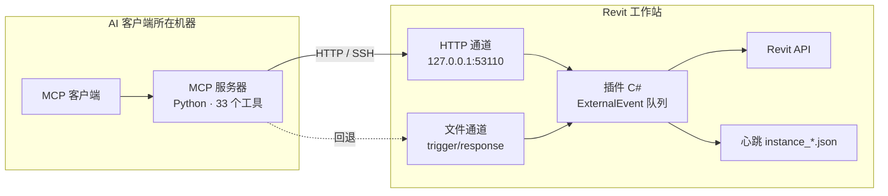

# 架构

!!! note "中文版"
    本页为中文精简版；把右上角语言切到 English 可看完整英文原文。

- **单一执行点**：所有模型访问都在 Revit 主线程，经 `ExternalEvent` 串行执行——这是 Revit API 的硬性要求，也是"同时只有一个任务"的原因。
- **通道可替换**：HTTP 与文件两条通道共用同一套任务契约，客户端按环境选一条；HTTP 适合长任务与并行，文件通道适合最小权限场景。
- **Core 与 Addin 分离**：`src/RevitModelMcp.Core` 不引用 Revit API（契约解析、参数校验、结果模型），可在 Linux 上跑单测；`src/RevitModelMcp.Addin` 只做 Revit 侧实现。
- **兼容层**：`src/RevitModelMcp.Addin/Compatibility/` 收纳各年份 API 差异（2020 的 `DisplayUnitType`/`UnitType`/`NewFloor` 与 2022+ 的 `ForgeTypeId`/`Floor.Create`）。
- **可观测**：插件日志（`文档\RevitModelMcp\Logs`）、心跳文件、每个结果的 `elapsedMs` 与分阶段计时都可用于定位问题。
