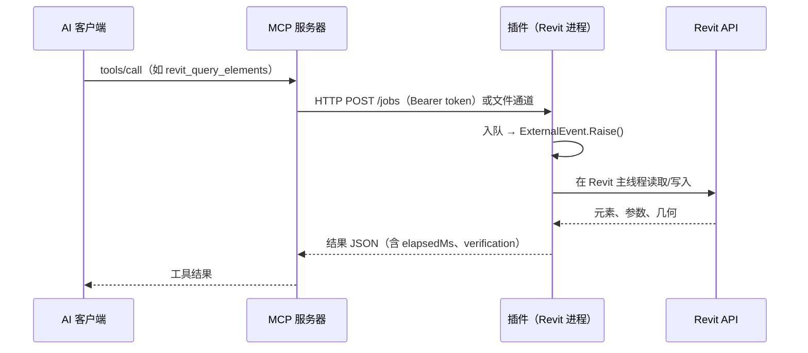

# 工作原理

!!! note "中文版"
    本页为中文精简版；把右上角语言切到 English 可看完整英文原文。

Revit Model MCP 由三部分组成：

| 组件 | 运行位置 | 职责 |
| --- | --- | --- |
| **MCP 服务器**（Python） | AI 客户端所在机器 | 把 33 个工具暴露给客户端；默认只读；写操作需要双门禁 |
| **插件**（C# / .NET） | Revit 工作站 | 在 Revit 进程内用 `ExternalEvent` 执行请求；持有 HTTP 与文件两个通道 |
| **Core 库**（C#） | 随插件 | 解析契约、校验参数、序列化结果——与 Revit API 无关，可单测 |

## 一次调用的路径

要点：

- **只在 Revit 主线程动模型**：所有动作都经 `ExternalEvent` 排队执行，所以同一时刻只有一个任务，动作类工具还要求"恰好一个 Revit 实例"。
- **读取默认只读**：读取工具不写模型，也不改变你的视图状态（`select`/`show`/`isolate` 属于动作类，会改选中与可见性）。
- **写操作双门禁**：客户端要 `REVIT_MCP_ALLOW_WRITE=1`，工作站要有 `%LOCALAPPDATA%\RevitModelMcp\allow-write` 文件。
- **结果自证**：动作返回 `verification`（改动前/后对照），重建类工具返回 `idMapping`/`idMappingVerified`，超时或失败不会被伪装成成功。
- **单位统一**：入参与返回值一律 mm / m² / m³，内部按 Revit API 单位换算。
