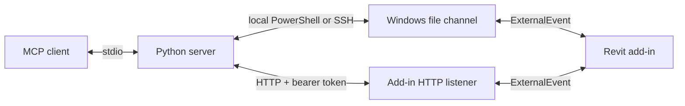

# Transport

`REVIT_MCP_HOST` selects `local`, `ssh:<alias>`, `http://host:port` or `https://host:port`.
`--host` overrides it.
HTTP connects directly to the add-in and requires no SSH server or remote file transfer.
The MCP client still communicates with the Python server over stdio.

## HTTP configuration

On first startup the add-in creates `%LOCALAPPDATA%\RevitModelMcp\settings.json`:

```json
{
  "httpEnabled": true,
  "httpBind": "127.0.0.1",
  "httpPort": 53110,
  "token": "<generated 32-byte base64url token>"
}
```

The token is per Windows user and persists across restarts.
Settings and the `allow-write` file remain in this default directory even when `REVIT_MCP_CHANNEL_DIR` overrides the file channel.
The add-in creates and restricts the file with a protected NTFS ACL granting full control only to the current Windows user.
Keep the token private and transfer it to the client's secret store through a trusted channel.
The add-in never logs it.
Do not put it in a URL, repository or shared shell history.

Revit environment variables override settings at startup: `REVIT_MCP_HTTP_ENABLED=0|1`, `REVIT_MCP_HTTP_BIND`, `REVIT_MCP_HTTP_PORT` and `REVIT_MCP_TOKEN`.
Overrides are not written back to the settings file.
Set `httpEnabled=false` or `REVIT_MCP_HTTP_ENABLED=0` to turn the listener off entirely.
Restart Revit after changing listener settings.
Invalid settings disable HTTP and leave the file channel available.

### Windows URL reservation

Elevated `install.ps1` installs and both MSI packages reserve `http://127.0.0.1:53110/` for the installing Windows user.
The single-user MSI requests elevation for this reservation and keeps its per-user installation scope.
Existing reservations are preserved on repeated installs.
Run the installer as the account that runs Revit; deployment as another account or SYSTEM requires a reservation for the Revit user.
Without elevation, `install.ps1` completes the file installation and prints the exact command to run once from an elevated command prompt:

```bat
netsh http add urlacl url=http://127.0.0.1:53110/ user="DOMAIN\name"
```

Changing `httpPort` or `httpBind` requires a matching URL reservation.
Use `+` in the reservation prefix for `httpBind=0.0.0.0`.
An access-denied warning in the add-in log includes the exact configured prefix and repair command.
The listener remains stopped until the reservation exists and Revit restarts.

MSI uninstall removes the default reservation; major upgrades retain it.
`install.ps1 -Uninstall` removes it after the last installed Revit year for the current user, or prints the removal command when not elevated.
Custom reservations require manual removal.

After installation, start Revit with a model open and check from PowerShell:

```powershell
Test-NetConnection 127.0.0.1 -Port 53110
curl.exe -i http://127.0.0.1:53110/health
```

The TCP check reports `TcpTestSucceeded: True`; `/health` returns HTTP 200.

### Client connection

The client reads `REVIT_MCP_TOKEN`; `--token` overrides it.
Prefer the environment populated by a secret store.
With the token already available in the client environment:

```sh
export REVIT_MCP_HOST=http://127.0.0.1:53110
uv run --directory server revit-model-mcp
```

HTTP has no built-in TLS.
Use an SSH tunnel, Tailscale or a TLS reverse proxy; the client validates HTTPS certificates.
Redirects are rejected to prevent forwarding the bearer token to another endpoint.
`/health` is unauthenticated and reveals the Revit version, active document name, process ID and read-only state.
All other routes require `Authorization: Bearer <token>`.

| Request | Result |
| --- | --- |
| `GET /health` | `ok`, `revitVersion`, `documentName`, `processId`, `readOnly` |
| `POST /jobs?timeout=120` | File-channel job JSON in the body; final response JSON with HTTP 200 |
| `GET /jobs/{id}` | HTTP 202 while pending; final response with HTTP 200; HTTP 404 after expiry |
| `GET /views/{name}/image?pixel=1600` | PNG bytes from the same view exporter used by `revit_export_view` |

POST waits default to 120 seconds and accept 0-600 seconds.
HTTP 202 contains `jobId`; it means the accepted job is still queued or executing.
A timeout or client disconnect does not cancel a job.
Results expire ten minutes after completion.
Do not resubmit an action after a timeout without checking its result and the model.
The Python client submits once with `timeout=0`, then polls within `timeout_seconds`.
`pickup_timeout_seconds` applies only to file transports.

HTTP 401 means the token is missing or invalid.
HTTP 409 means another HTTP or file job owns the channel.
HTTP 403 rejects action jobs when the workstation `allow-write` gate is absent.
MCP action tools also require `REVIT_MCP_ALLOW_WRITE=1` in the Python process.
HTTP jobs use the existing ExternalEvent and share the file channel's single-job rule.
Jobs are limited to 1 MiB.

View names must be URL-encoded; `pixel` accepts 1-4000.
Image requests can return HTTP 202 with `jobId` after 120 seconds.
Poll `/jobs/{id}`, then append `jobId={id}` to the image URL to fetch that export without executing it again.
The optional `document` query must match the job's `targetDocument`.
The Python exporter follows this path and preserves response metadata and the local PNG path.
HTTP image artifacts fetched this way expire with the result.

Each HTTP endpoint belongs to one Revit process.
For several instances, configure a distinct port in each process environment before launch.
An occupied port disables HTTP for the later instance and produces a log message.
`revit_list_instances` reports the connected endpoint in HTTP mode.
`targetDocument` and `targetProcessId` are checked in the Revit API context before execution.

## Remote setups

For a corporate PC without administrator rights, use option 2 with IT-provisioned Tailscale or option 3 with existing SSH access.
Never expose the endpoint on the office LAN.
If neither service is available, IT must provision a route first; this add-in cannot bypass that requirement.

### 1. Same LAN

Use this only on a trusted network where the workstation owner permits direct access.
Set `httpBind` to `0.0.0.0` explicitly, or set `REVIT_MCP_HTTP_BIND=0.0.0.0` before starting Revit.
Run once in an elevated Windows command prompt, replacing `<user>` with the account running Revit, such as `DOMAIN\name`:

```bat
netsh http add urlacl url=http://+:53110/ user=<user>
netsh advfirewall firewall add rule name="Revit Model MCP" dir=in action=allow protocol=TCP localport=53110
```

On the Mac at the clone root, replace `revit-host` with the workstation hostname and supply `REVIT_MCP_TOKEN` through the secret store:

```sh
export REVIT_MCP_HOST=http://revit-host:53110
uv run --directory server revit-model-mcp
```

The bearer token and model data are plaintext on this route.
Prefer a tunnel whenever possible.
The listener logs the required URL reservation command on access denied.
Windows may also require an explicit loopback reservation under a restricted account.
For a specific bind address, use that address in the URL ACL instead of `+`.
See [Microsoft HttpListener prefix guidance](https://learn.microsoft.com/en-us/dotnet/api/system.net.httplistener?view=netframework-4.8.1).

### 2. Different networks: Tailscale

Install Tailscale on both machines and join the same permitted tailnet.
Windows installation requires local administrator access once; IT must also provision the URL ACL and any required firewall permission for the Tailscale interface.
Routine use then runs under the Revit user's account.
Bind to the workstation's Tailscale IPv4 address instead of `0.0.0.0` when possible.
Use that same address in the URL ACL and restrict firewall access to the permitted Tailscale peer.
See [Tailscale installation for Windows](https://tailscale.com/docs/install/windows).

```sh
export REVIT_MCP_HOST=http://100.101.102.103:53110
uv run --directory server revit-model-mcp
```

For a Mac without administrator rights, standalone `tailscaled` and `tailscale` binaries can run in userspace mode with an HTTP proxy and user-owned state.
With those binaries available in PATH:

```sh
mkdir -p "$HOME/.local/state/tailscale-revit"
tailscaled --tun=userspace-networking \
  --state="$HOME/.local/state/tailscale-revit/state" \
  --socket="$HOME/.local/state/tailscale-revit/socket" \
  --outbound-http-proxy-listen=127.0.0.1:1055
```

In another terminal:

```sh
tailscale --socket="$HOME/.local/state/tailscale-revit/socket" up
export http_proxy=http://127.0.0.1:1055
export https_proxy=http://127.0.0.1:1055
export REVIT_MCP_HOST=http://100.101.102.103:53110
uv run --directory server revit-model-mcp
```

The Python HTTP transport honors these standard proxy environment variables.
Userspace mode does not create a system VPN interface; the proxy supplies the route.
See [Tailscale userspace networking](https://tailscale.com/docs/concepts/userspace-networking).

### 3. Existing SSH: loopback port forward

This option keeps the workstation listener on `127.0.0.1` and is the safest setup when sshd is already available.
It opens no new office-LAN port.

```sh
ssh -N -L 53110:127.0.0.1:53110 user@host
```

In another terminal, with the bearer token in the environment:

```sh
export REVIT_MCP_HOST=http://127.0.0.1:53110
uv run --directory server revit-model-mcp
```

### 4. Legacy SSH file channel

The existing transport remains available without HTTP:

```sh
export REVIT_MCP_HOST=ssh:revit-host
uv run --directory server revit-model-mcp
```

Set `httpEnabled=false` on the workstation if only the file channel is needed.

## File channel

The default directory is `%LOCALAPPDATA%\RevitModelMcp` on the Windows account running Revit.
Set `REVIT_MCP_CHANNEL_DIR` to an absolute Windows path to override it.
The server and Revit must use the same directory.
The Revit environment must contain the override before Revit starts.

| File | Role |
| --- | --- |
| `mcp_<uuid>.tmp` | JSON job before publication |
| `trigger.txt` | Published job awaiting pickup |
| `response_<timestamp>_<command>.json` | Add-in response |
| `view_<timestamp>_<id>.png` | Exported view before download |
| `instance_<processId>.json` | Instance heartbeat |

The file transport operates independently of the optional HTTP listener.
Revit API work runs through ExternalEvent.
Pending files remain on disk if the server stops.
There is no automatic cancellation of a published job.
The channel relies on Windows file permissions.

## Local host

`REVIT_MCP_HOST=local` is the default.
The server invokes `powershell.exe -NoProfile -NonInteractive -EncodedCommand` on Windows.
The process checks Revit, publishes jobs and reads responses under the current Windows account.
This mode requires PowerShell and a running Revit instance with the add-in loaded.
macOS and Linux clients use HTTP or SSH to reach Windows.

## SSH host

`REVIT_MCP_HOST=ssh:<alias>` selects a host in the client's SSH configuration.
`--host ssh:<alias>` provides the same setting on the command line.
The client invokes `ssh` with batch mode and a 45-second connection timeout.
The remote command runs Windows PowerShell with a UTF-16LE base64-encoded script.
Host aliases are validated and PowerShell path literals escape single quotes.
SSH credentials and routing belong to the user's SSH configuration.

Responses and exported PNG files are transferred as base64 in the PowerShell result.
The server decodes the image into `save_to` or a new temporary directory.
An existing destination file produces an error.
The MCP result contains the image path and metadata without base64.

Each SSH invocation includes `-o ControlMaster=auto -o ControlPath=<dir>/mux-%C -o ControlPersist=600` by default.
Commands for the same connection reuse the master instead of opening a new TCP connection for each PowerShell call.
The master persists for 600 idle seconds.
`<dir>` is `$XDG_RUNTIME_DIR` when nonempty, otherwise `/tmp/revit-model-mcp-<uid>/`.
The directory is created or restricted to mode `0700` on macOS and Linux.
Keep the directory path short; `%C` provides a hashed connection identifier within the Unix socket path limit.

`REVIT_MCP_SSH_MUX=0` disables these built-in multiplexing options.
Use it on clients without multiplexing support, such as native Windows OpenSSH.
`REVIT_MCP_SSH_OPTIONS` appends shell-quoted arguments after built-in options and before the host, for example `-o ServerAliveInterval=30 -p 2222`.
OpenSSH uses the first value for an option.
A custom socket path or lifetime requires `REVIT_MCP_SSH_MUX=0` plus all three `Control*` options in `REVIT_MCP_SSH_OPTIONS`.
Local mode ignores both variables and creates no multiplexing directory.

SSH command starts retain a limit of five per rolling 30 seconds within one host object.
Polling waits ten seconds between attempts.
Job preparation and final response retrieval each use one command.
Transient failures during polling can be retried within the remaining timeout.
Local mode uses the same file operations and polling without the SSH connection limiter.

## Optional activation

Set `REVIT_MCP_ACTIVATE_TASK` to the name of an existing Windows scheduled task that activates Revit.
After 60 seconds without pickup the next check can invoke that task once.
Activation only occurs if `trigger.txt` still exists.
The server checks the task result and reports activation failure separately.
The task is optional and is never created by the server.
The default pickup timeout is 300 seconds, followed by a separate 120-second response timeout.

## Path redaction

`REVIT_MCP_REDACT_PATHS=1` or `--redact-paths` strips directories from response `documentPath` and all nested `path` fields, including RVT/CAD/image link paths.
This applies to responder metadata and instance listings.
Image `localPath` remains available to the MCP client.
The option does not sanitize channel files or arbitrary strings in model data and errors.
See [server configuration](../server/README.md#configuration).

## Client registration

With the loopback SSH tunnel above running, register the endpoint from the clone root:

```sh
claude mcp add revit-model-mcp -e REVIT_MCP_HOST=http://127.0.0.1:53110 -e REVIT_MCP_REDACT_PATHS=1 -- uv run --directory "$PWD/server" revit-model-mcp
```

The server process must inherit `REVIT_MCP_TOKEN` from the client's environment or secret configuration.
For the SSH file channel, use `-e REVIT_MCP_HOST=ssh:revit-host` instead; no HTTP token is needed.

## Request architecture



The server submits jobs over HTTP or writes them to the Windows file channel.
The add-in processes both through the same ExternalEvent and accepts one job at a time.
HTTP returns JSON and PNG directly; local and SSH modes keep their file-based responses.
A heartbeat identifies each Revit instance and its active document.
The default tools read model data and export images.
Opt-in actions use the same channel and execute in the Revit API context.
See [how it works](how-it-works.md), [architecture](architecture.md) and the [feed format](feed-format.md).

## Installation from a clone

The add-in requires Windows and Revit 2020-2027.
Build with the .NET SDK selected by [`global.json`](../global.json).
The server requires Python 3.11 or later, [uv](https://docs.astral.sh/uv/getting-started/installation/) and an MCP client.
Clone on each machine that will build or run a component:

```sh
git clone https://github.com/sharafutdinovdi/revit-model-mcp.git
cd revit-model-mcp
```

The commands below start from the repository root.
For a downloaded script, use `Unblock-File .\install.ps1` to remove its downloaded-file block or `Set-ExecutionPolicy -Scope Process Bypass` for the current PowerShell session.
On Windows, close Revit and build and install for Revit 2026:

```powershell
.\install.ps1 -Year 2026 -Source Build
```

Or install the latest GitHub release for every detected Revit year (2020-2027):

```powershell
.\install.ps1 -Source Release
```

The inline build, copy and manifest-patching commands live in [`install.ps1`](../install.ps1).
Installation uses `RevitModelMcp\` and `RevitModelMcp.addin` under `%APPDATA%\Autodesk\Revit\Addins\<year>`.
Use `-Year 2024,2026` to select years and `-Version 0.2.0` to pin a release.
`-Source Release` requires a release with an asset for each requested year: v0.1.0 ships R22–R26 and v0.2.0 adds R27, so Revit 2020 needs a release cut after R20 was added to the release workflow, or `-Source Build`.
Add `-SignThumbprint <thumbprint>` to sign installed DLLs with a local code-signing certificate on workstations where Revit shows the unsigned add-in dialog on every rebuild.
Add `-RegisterClaude` to register the local server with Claude Code; both `claude` and `uv` must be on PATH.
Use `-Uninstall -Year 2026` to remove that year's add-in; local settings remain intact.
The script refuses to run while Revit is open unless `-Force` is supplied.
Start Revit and open a model after installation, or restart it if it was already running.
The add-in creates `%LOCALAPPDATA%\RevitModelMcp\instance_<processId>.json` and updates it every five seconds.
It adds no ribbon tab or button.
