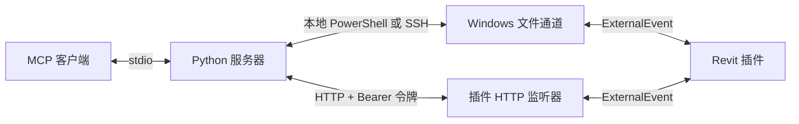

<a id="transport"></a>

# 传输

`REVIT_MCP_HOST` 用于选择 `local`、`ssh:<alias>`、`http://host:port` 或 `https://host:port`。
`--host` 会覆盖该设置。
HTTP 直接连接插件，无需 SSH 服务器或远程文件传输。
MCP 客户端仍通过 stdio 与 Python 服务器通信。

<a id="http-configuration"></a>

## HTTP 配置

首次启动时，插件创建 `%LOCALAPPDATA%\RevitModelMcp\settings.json`：

```json
{
  "httpEnabled": true,
  "httpBind": "127.0.0.1",
  "httpPort": 53110,
  "token": "<generated 32-byte base64url token>"
}
```

令牌按 Windows 用户分配，重启后仍保留。
即使 `REVIT_MCP_CHANNEL_DIR` 覆盖了文件通道目录，设置和 `allow-write` 文件仍位于这个默认目录中。
插件创建该文件，并使用受保护的 NTFS ACL 限制访问，仅授予当前 Windows 用户完全控制权限。
保持令牌私密，通过可信渠道将其转移到客户端的秘密存储中。
插件永远不会将令牌写入日志。
不要把令牌放入 URL、仓库或共享的 shell 历史记录。

Revit 环境变量会在启动时覆盖设置：`REVIT_MCP_HTTP_ENABLED=0|1`、`REVIT_MCP_HTTP_BIND`、`REVIT_MCP_HTTP_PORT` 和 `REVIT_MCP_TOKEN`。
覆盖值不会写回设置文件。
设置 `httpEnabled=false` 或 `REVIT_MCP_HTTP_ENABLED=0` 可彻底关闭监听器。
修改监听器设置后需要重启 Revit。
无效设置会禁用 HTTP，但文件通道仍可使用。

<a id="windows-url-reservation"></a>

### Windows URL 预留

以提升权限运行的 `install.ps1` 安装过程，以及两种 MSI 安装包，都会为执行安装的 Windows 用户预留 `http://127.0.0.1:53110/`。
单用户 MSI 会为此预留请求提升权限，同时仍保持按用户安装的范围。
重复安装时会保留已有预留。
应使用运行 Revit 的账户执行安装程序；若以其他账户或 SYSTEM 部署，需要为 Revit 用户另行设置预留。
没有提升权限时，`install.ps1` 会完成文件安装，并打印需要在提升权限的命令提示符中执行一次的确切命令：

```bat
netsh http add urlacl url=http://127.0.0.1:53110/ user="DOMAIN\name"
```

修改 `httpPort` 或 `httpBind` 后，需要设置匹配的 URL 预留。
对于 `httpBind=0.0.0.0`，在预留前缀中使用 `+`。
插件日志中的访问被拒绝警告会包含确切的配置前缀和修复命令。
在预留建立且 Revit 重启之前，监听器保持停止状态。

MSI 卸载会移除默认预留；大版本升级会保留它。
`install.ps1 -Uninstall` 会在移除当前用户最后一个已安装的 Revit 年份后删除预留；若没有提升权限，则打印移除命令。
自定义预留需要手动移除。

安装后，启动 Revit 并打开模型，然后在 PowerShell 中检查：

```powershell
Test-NetConnection 127.0.0.1 -Port 53110
curl.exe -i http://127.0.0.1:53110/health
```

TCP 检查应报告 `TcpTestSucceeded: True`；`/health` 应返回 HTTP 200。

<a id="client-connection"></a>

### 客户端连接

客户端读取 `REVIT_MCP_TOKEN`；`--token` 会覆盖它。
优先使用由秘密存储填充的环境变量。
令牌已存在于客户端环境时：

```sh
export REVIT_MCP_HOST=http://127.0.0.1:53110
uv run --directory server revit-model-mcp
```

HTTP 没有内置 TLS。
使用 SSH 隧道、Tailscale 或 TLS 反向代理；客户端会验证 HTTPS 证书。
为避免将 Bearer 令牌转发到其他端点，客户端拒绝重定向。
`/health` 不要求认证，会公开 Revit 版本、活动文档名称、进程 ID 和只读状态。
其他所有路由都要求 `Authorization: Bearer <token>`。

| 请求 | 结果 |
| --- | --- |
| `GET /health` | `ok`、`revitVersion`、`documentName`、`processId`、`readOnly` |
| `POST /jobs?timeout=120` | 请求体为文件通道任务 JSON；最终响应 JSON 返回 HTTP 200 |
| `GET /jobs/{id}` | 待处理时返回 HTTP 202；最终响应返回 HTTP 200；过期后返回 HTTP 404 |
| `GET /views/{name}/image?pixel=1600` | 返回 PNG 字节，使用与 `revit_export_view` 相同的视图导出器 |

POST 默认等待 120 秒，接受 0–600 秒。
HTTP 202 包含 `jobId`，表示已接受的任务仍在排队或执行。
超时或客户端断开连接不会取消任务。
结果在完成十分钟后过期。
动作超时后，不要在检查结果和模型之前重新提交。
Python 客户端以 `timeout=0` 提交一次，然后在 `timeout_seconds` 范围内轮询。
`pickup_timeout_seconds` 仅适用于文件传输。

HTTP 401 表示令牌缺失或无效。
HTTP 409 表示另一个 HTTP 或文件任务占用了通道。
工作站缺少 `allow-write` 门禁时，HTTP 403 会拒绝动作任务。
MCP 动作工具还要求 Python 进程中启用 `REVIT_MCP_ALLOW_WRITE=1`。
HTTP 任务使用已有的 ExternalEvent，并与文件通道共用同一时间只处理一个任务的规则。
任务大小限制为 1 MiB。

视图名称必须进行 URL 编码；`pixel` 接受 1–4000。
图像请求可能在 120 秒后返回包含 `jobId` 的 HTTP 202。
轮询 `/jobs/{id}`，然后在图像 URL 中追加 `jobId={id}`，即可取回该次导出而不再次执行。
可选的 `document` 查询参数必须与任务的 `targetDocument` 匹配。
Python 导出器遵循这一路径，并保留响应元数据和本地 PNG 路径。
以这种方式获取的 HTTP 图像产物与结果一同过期。

每个 HTTP 端点属于一个 Revit 进程。
若运行多个实例，应在启动前为每个进程的环境配置不同端口。
端口已被占用时，后启动的实例会禁用 HTTP 并写入日志消息。
HTTP 模式下，`revit_list_instances` 报告所连接端点对应的实例。
执行前，会在 Revit API 上下文中检查 `targetDocument` 和 `targetProcessId`。

<a id="remote-setups"></a>

## 远程配置

对于没有管理员权限的企业电脑，使用方案 2 中由 IT 配置的 Tailscale，或方案 3 中已有的 SSH 访问。
不要将端点暴露到办公局域网。
如果两项服务都不可用，必须先由 IT 配置访问路由；本插件无法绕过这一要求。

<a id="1-same-lan"></a>

### 1. 同一局域网

仅在可信网络中，且工作站所有者允许直接访问时使用。
显式将 `httpBind` 设为 `0.0.0.0`，或在启动 Revit 前设置 `REVIT_MCP_HTTP_BIND=0.0.0.0`。
在提升权限的 Windows 命令提示符中执行一次以下命令，将 `<user>` 替换为运行 Revit 的账户，例如 `DOMAIN\name`：

```bat
netsh http add urlacl url=http://+:53110/ user=<user>
netsh advfirewall firewall add rule name="Revit Model MCP" dir=in action=allow protocol=TCP localport=53110
```

在 Mac 的克隆仓库根目录中，将 `revit-host` 替换为工作站主机名，并通过秘密存储提供 `REVIT_MCP_TOKEN`：

```sh
export REVIT_MCP_HOST=http://revit-host:53110
uv run --directory server revit-model-mcp
```

在这一路由上，Bearer 令牌和模型数据以明文传输。
尽可能优先使用隧道。
监听器遇到访问被拒绝时，会记录所需的 URL 预留命令。
在受限账户下，Windows 还可能要求显式设置回环地址预留。
对于特定绑定地址，在 URL ACL 中使用该地址，而非 `+`。
参见 [Microsoft HttpListener 前缀指南](https://learn.microsoft.com/en-us/dotnet/api/system.net.httplistener?view=netframework-4.8.1)。

<a id="2-different-networks-tailscale"></a>

### 2. 不同网络：Tailscale

在两台机器上安装 Tailscale，并加入同一个经许可的 tailnet。
Windows 安装需要一次本地管理员权限；IT 还必须配置 URL ACL 和 Tailscale 接口所需的防火墙权限。
之后的日常使用以 Revit 用户的账户运行。
尽可能绑定到工作站的 Tailscale IPv4 地址，而非 `0.0.0.0`。
在 URL ACL 中使用同一地址，并将防火墙访问限制为获准的 Tailscale 对端。
参见 [Tailscale Windows 安装文档](https://tailscale.com/docs/install/windows)。

```sh
export REVIT_MCP_HOST=http://100.101.102.103:53110
uv run --directory server revit-model-mcp
```

对于没有管理员权限的 Mac，独立的 `tailscaled` 和 `tailscale` 二进制程序可以在用户态模式下运行，使用 HTTP 代理和用户拥有的状态文件。
确保这些程序位于 PATH 后：

```sh
mkdir -p "$HOME/.local/state/tailscale-revit"
tailscaled --tun=userspace-networking \
  --state="$HOME/.local/state/tailscale-revit/state" \
  --socket="$HOME/.local/state/tailscale-revit/socket" \
  --outbound-http-proxy-listen=127.0.0.1:1055
```

在另一个终端中：

```sh
tailscale --socket="$HOME/.local/state/tailscale-revit/socket" up
export http_proxy=http://127.0.0.1:1055
export https_proxy=http://127.0.0.1:1055
export REVIT_MCP_HOST=http://100.101.102.103:53110
uv run --directory server revit-model-mcp
```

Python HTTP 传输遵循这些标准代理环境变量。
用户态模式不会创建系统 VPN 接口；访问路由由代理提供。
参见 [Tailscale 用户态网络](https://tailscale.com/docs/concepts/userspace-networking)。

<a id="3-existing-ssh-loopback-port-forward"></a>

### 3. 已有 SSH：回环端口转发

此方案让工作站监听器继续绑定 `127.0.0.1`，在已有 sshd 的情况下是最安全的配置。
它不会开放新的办公局域网端口。

```sh
ssh -N -L 53110:127.0.0.1:53110 user@host
```

在另一个终端中，确保环境中已有 Bearer 令牌：

```sh
export REVIT_MCP_HOST=http://127.0.0.1:53110
uv run --directory server revit-model-mcp
```

<a id="4-legacy-ssh-file-channel"></a>

### 4. 旧版 SSH 文件通道

不使用 HTTP 时，原有传输方式仍然可用：

```sh
export REVIT_MCP_HOST=ssh:revit-host
uv run --directory server revit-model-mcp
```

若只需要文件通道，在工作站设置 `httpEnabled=false`。

<a id="file-channel"></a>

## 文件通道

默认目录位于运行 Revit 的 Windows 账户下，为 `%LOCALAPPDATA%\RevitModelMcp`。
将 `REVIT_MCP_CHANNEL_DIR` 设置为绝对 Windows 路径即可覆盖它。
服务器和 Revit 必须使用同一目录。
覆盖设置必须在 Revit 启动前存在于其环境中。

| 文件 | 作用 |
| --- | --- |
| `mcp_<uuid>.tmp` | 发布前的 JSON 任务 |
| `trigger.txt` | 已发布、等待拾取的任务 |
| `response_<timestamp>_<command>_<correlationId>.json` | 插件响应 |
| `view_<timestamp>_<id>.png` | 下载前导出的视图 |
| `instance_<processId>.json` | 实例心跳 |

文件传输独立于可选的 HTTP 监听器运行。
Revit API 工作通过 ExternalEvent 执行。
服务器停止后，待处理文件仍留在磁盘上。
已发布的任务不会自动取消。
通道依赖 Windows 文件权限。

<a id="local-host"></a>

## 本地主机

`REVIT_MCP_HOST=local` 是默认设置。
服务器在 Windows 上调用 `powershell.exe -NoProfile -NonInteractive -EncodedCommand`。
该进程以当前 Windows 账户检查 Revit、发布任务并读取响应。
此模式需要 PowerShell，以及一个已加载插件的运行中 Revit 实例。
macOS 和 Linux 客户端通过 HTTP 或 SSH 访问 Windows。

<a id="ssh-host"></a>

## SSH 主机

`REVIT_MCP_HOST=ssh:<alias>` 选择客户端 SSH 配置中的主机。
`--host ssh:<alias>` 可在命令行中提供同一设置。
客户端以批处理模式调用 `ssh`，连接超时为 45 秒。
远程命令运行 Windows PowerShell，使用经 UTF-16LE base64 编码的脚本。
主机别名会经过校验；PowerShell 路径字面量中的单引号会被转义。
SSH 凭据和路由由用户的 SSH 配置管理。

响应和导出的 PNG 文件在 PowerShell 结果中以 base64 传输。
服务器将图像解码到 `save_to` 或新建的临时目录中。
目标文件已存在时会产生错误。
MCP 结果包含图像路径和元数据，不包含 base64。

每次 SSH 调用默认都包含 `-o ControlMaster=auto -o ControlPath=<dir>/mux-%C -o ControlPersist=600`。
同一连接上的命令会复用主连接，而非每次 PowerShell 调用都建立新的 TCP 连接。
主连接在空闲后保留 600 秒。
`<dir>` 使用非空的 `$XDG_RUNTIME_DIR`，否则使用 `/tmp/revit-model-mcp-<uid>/`。
在 macOS 和 Linux 上，该目录会被创建或限制为 `0700` 权限。
保持目录路径简短；`%C` 使用哈希连接标识符，以满足 Unix 套接字路径长度限制。

`REVIT_MCP_SSH_MUX=0` 会禁用这些内置多路复用选项。
在不支持多路复用的客户端上使用它，例如 Windows 原生 OpenSSH。
`REVIT_MCP_SSH_OPTIONS` 在内置选项之后、主机之前追加按 shell 引号规则解析的参数，例如 `-o ServerAliveInterval=30 -p 2222`。
OpenSSH 对每个选项采用第一个值。
若要自定义套接字路径或生命周期，需要设置 `REVIT_MCP_SSH_MUX=0`，并在 `REVIT_MCP_SSH_OPTIONS` 中提供全部三个 `Control*` 选项。
local 模式忽略这两个变量，且不创建多路复用目录。

同一个主机对象在任意滚动的 30 秒内最多启动五次 SSH 命令。
轮询尝试之间等待十秒。
任务准备和最终响应取回各使用一次命令。
轮询期间的瞬时故障可以在剩余超时时间内重试。
local 模式使用相同的文件操作和轮询，但没有 SSH 连接限流。

<a id="optional-activation"></a>

## 可选的窗口激活

将 `REVIT_MCP_ACTIVATE_TASK` 设为一个已有 Windows 计划任务的名称，该任务应负责激活 Revit。
任务 60 秒仍未被拾取时，下一次检查可以调用该计划任务一次。
仅当 `trigger.txt` 仍存在时才会激活。
服务器会检查计划任务结果，并单独报告激活失败。
计划任务是可选的，服务器永远不会创建它。
默认拾取超时为 300 秒，之后另有独立的 120 秒响应超时。

<a id="path-redaction"></a>

## 路径脱敏

`REVIT_MCP_REDACT_PATHS=1` 或 `--redact-paths` 会移除响应 `documentPath` 和所有嵌套 `path` 字段中的目录部分，包括 RVT/CAD/图像链接路径。
这适用于响应实例元数据和实例列表。
图像的 `localPath` 仍可供 MCP 客户端使用。
此选项不会清理通道文件，也不会处理模型数据和错误中的任意字符串。
参见[服务器配置](../server/README.md#configuration)。

<a id="client-registration"></a>

## 客户端注册

保持上述回环 SSH 隧道运行，从克隆仓库根目录注册端点：

```sh
claude mcp add revit-model-mcp -e REVIT_MCP_HOST=http://127.0.0.1:53110 -e REVIT_MCP_REDACT_PATHS=1 -- uv run --directory "$PWD/server" revit-model-mcp
```

服务器进程必须从客户端环境或秘密配置中继承 `REVIT_MCP_TOKEN`。
若使用 SSH 文件通道，改用 `-e REVIT_MCP_HOST=ssh:revit-host`；无需 HTTP 令牌。

<a id="request-architecture"></a>

## 请求架构



服务器通过 HTTP 提交任务，或将任务写入 Windows 文件通道。
插件通过同一个 ExternalEvent 处理两种通道，同一时间只接受一个任务。
HTTP 直接返回 JSON 和 PNG；local 和 SSH 模式保留基于文件的响应。
心跳标识每个 Revit 实例及其活动文档。
默认工具读取模型数据和导出图像。
显式启用的动作使用同一通道，并在 Revit API 上下文中执行。
参见[工作原理](how-it-works.md)、[架构](architecture.md)和[数据格式](feed-format.md)。

<a id="installation-from-a-clone"></a>

## 从克隆仓库安装

插件需要 Windows 和 Revit 2020–2027。
使用 [`global.json`](../global.json) 指定的 .NET SDK 构建。
服务器需要 Python 3.11 或更新版本、[uv](https://docs.astral.sh/uv/getting-started/installation/) 和一个 MCP 客户端。
在需要构建或运行组件的每台机器上克隆仓库：

```sh
git clone https://github.com/sharafutdinovdi/revit-model-mcp.git
cd revit-model-mcp
```

以下命令从仓库根目录执行。
对于下载的脚本，可使用 `Unblock-File .\install.ps1` 移除下载文件阻止标记，或使用 `Set-ExecutionPolicy -Scope Process Bypass` 为当前 PowerShell 会话设置执行策略。
在 Windows 上，关闭 Revit，然后为 Revit 2026 构建并安装：

```powershell
.\install.ps1 -Year 2026 -Source Build
```

也可以为检测到的所有 Revit 年份（2020–2027）安装最新 GitHub 发布版本：

```powershell
.\install.ps1 -Source Release
```

内联构建、复制和清单修补命令位于 [`install.ps1`](../install.ps1)。
安装会在 `%APPDATA%\Autodesk\Revit\Addins\<year>` 下使用 `RevitModelMcp\` 和 `RevitModelMcp.addin`。
使用 `-Year 2024,2026` 选择年份，使用 `-Version 0.2.0` 固定发布版本。
`-Source Release` 要求发布版本为每个请求的年份提供资产：v0.1.0 提供 R22–R26，v0.2.0 新增 R27，因此 Revit 2020 需要使用在发布工作流加入 R20 后生成的发布版本，或使用 `-Source Build`。
对于每次重新构建后 Revit 都显示未签名插件对话框的工作站，可添加 `-SignThumbprint <thumbprint>`，使用本地代码签名证书签署已安装的 DLL。
添加 `-RegisterClaude` 可向 Claude Code 注册本地服务器；`claude` 和 `uv` 都必须位于 PATH。
使用 `-Uninstall -Year 2026` 移除该年份的插件；本地设置保持不变。
Revit 打开时，脚本会拒绝运行，除非指定 `-Force`。
安装后启动 Revit 并打开模型；若 Revit 已在运行，则重启它。
插件创建 `%LOCALAPPDATA%\RevitModelMcp\instance_<processId>.json`，并每五秒更新一次。
它不会添加功能区选项卡或按钮。
